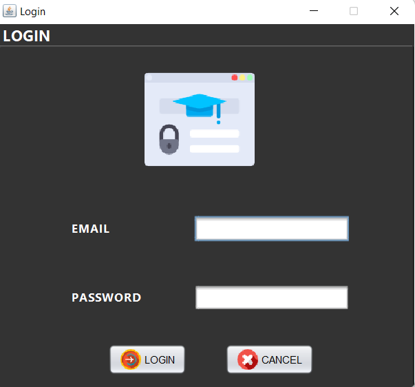
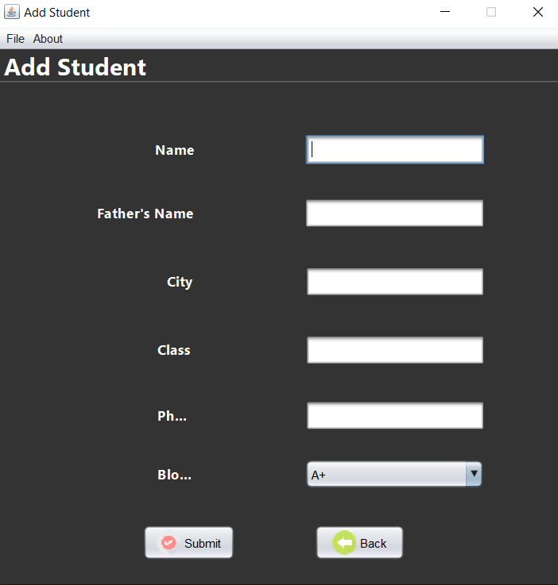
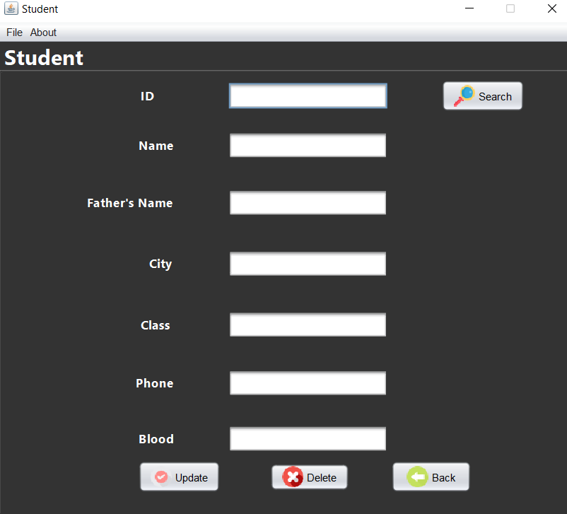
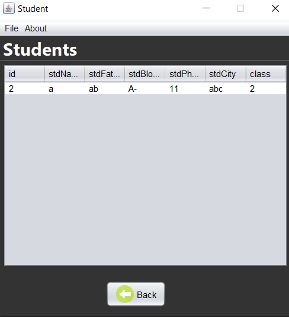
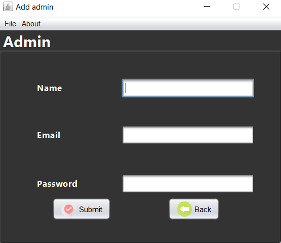
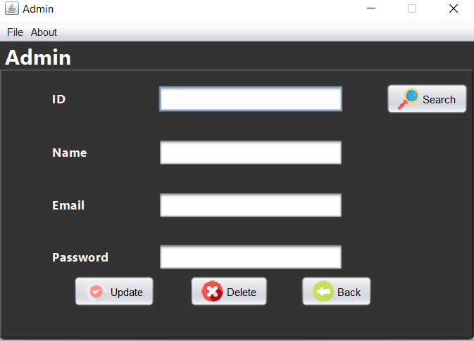
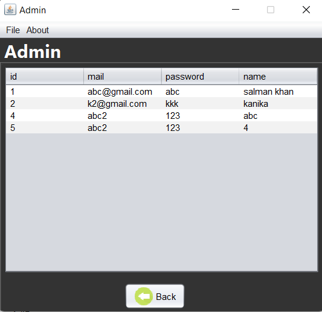

## Student Management System using Apache NetBeans.

# Prerequisites:
1.  You need to download **mysql-connector-j** and **rs2xml** jar files.
2.  Store these files **C:\Program Files\Java\jdk1.8.0_341\jre\lib\ext**

# Preview

